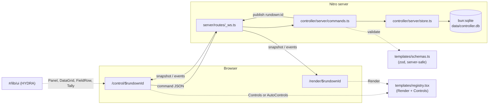

## Architecture




Every mutation flows through the WebSocket, so the controller and renderer converge on identical state with no polling. Both pages use the same subscription hook and the same snapshot shape; the renderer just ignores everything except `props` and `onScreen`.

## Control-room UI (`#/lib/ui`)

The operator surface is composed entirely from the HYDRA kit rather than hand-rolled Tailwind. [src/lib/ui/reference/ui_kits/graphics_controller/index.html](src/lib/ui/reference/ui_kits/graphics_controller/index.html) is a working reference for exactly this screen ("rundown of graphics, PGM/PVW with tally, template property editor, event log"), so treat its layout, density, and component composition as the spec.

Rules from [src/lib/ui/README.md](src/lib/ui/README.md) that constrain the work:

- Import from the barrel: `import { Panel, Button, DataGrid, Tally, Badge, Dialog, StatusBar, LogConsole, FieldRow, Input, Select, Switch, Checkbox, Tabs } from '#/lib/ui'`.
- Do not edit anything under `src/lib/ui/`; app-specific composites live in the route folders. Never fork styling — read the CSS variables in `tokens/`.
- **Tally colors are strict.** Red (`--tally-pgm`) means on air and nothing else; green (`--tally-pvw`) means cued/next and nothing else. Selection and general accents use `--info` blue. This directly affects the bracket controls below.
- Copy conventions: uppercase tracked labels, terse operational voice, no emoji, instance labels in SNAKE_UPPER (`L3_TIMOTHY_THATCHER`), zero-padded indices (`001`).
- Tally and bus changes have a 0ms transition; nothing in the operator UI animates beyond 120ms.

The kit ships `.jsx` sources with sibling `.d.ts` files. `bunx tsc --noEmit` is already clean against them (the only current errors are pre-existing unused-variable ones in `src/html/ui/Image.tsx`), so no shimming or `allowJs` change is needed.

### Loading styles without contaminating the on-air frame

`shell.css` sets base element rules that would wreck the transparent 1920x1080 output, so it must never load on `/graphics` or `/render`. A bare `import '#/lib/ui/shell.css'` in a route module is global once evaluated, so instead follow the `appCss` pattern already in [src/routes/__root.tsx](src/routes/__root.tsx) and attach it as a scoped `<link>` from a new `/control` layout route:

```tsx
// src/routes/control/route.tsx
import shellCss from '#/lib/ui/shell.css?url'

export const Route = createFileRoute('/control')({
  ssr: false,
  head: () => ({ links: [{ rel: 'stylesheet', href: shellCss }] }),
  component: ControlLayout,
})
```

The layout renders the HYDRA title strip (`HYDRA / GFX`, an `ON AIR` `Badge` when anything is live), an `<Outlet />`, and the app-bottom `StatusBar`.

## Template registration

Split each template into a server-safe data half and a client half so the server bundle never pulls in `motion`, textures, or R3F:

- `src/controller/templates/types.ts` — `FieldDef`, `TemplateSchema<TProps>` (`id`, `name`, zod `schema`, `defaults`, optional `fields`), `TemplateDefinition<TProps>` (schema plus `Render` and optional `Controls`), and `defineTemplate()`.
- `src/controller/templates/schemas.ts` — explicit imports of every `-schema.ts`; used by the server for validation/defaults and by the controller to list available templates.
- `src/controller/templates/registry.tsx` — explicit imports of every `-template.tsx`; client-only, keyed by id.

`FieldDef` deliberately mirrors the kit's `PropertyField` from [PropertyEditor.d.ts](src/lib/ui/components/data/PropertyEditor.d.ts) so the generated form stays a thin adapter rather than a parallel design: a `type` of `text | select | checkbox | switch | readonly`, plus `label`, `options`, `caption`, `labels`, `unit`, `align`, and an optional `section` for grouping into titled blocks. Two types are added that `PropertyField` lacks (`number` and `color`), which is why `AutoControls` composes `FieldRow` + `Input`/`Select`/`Checkbox`/`Switch` — the same primitives `PropertyEditor` itself uses, and what `FieldRow.prompt.md` recommends for custom forms — instead of calling `PropertyEditor` directly.

The two component contracts:

```tsx
type TemplateRenderProps<TProps> = { props: TProps; onScreen: boolean }

type TemplateControlsProps<TProps> = {
  props: TProps
  patch: (patch: Partial<TProps>) => void   // shallow merge
  replace: (next: TProps) => void           // for derived state (bracket winners)
  onScreen: boolean
  setOnScreen: (onScreen: boolean) => void
}
```

A template with `fields` gets a generated form from `AutoControls`; a template with `Controls` renders that component instead. `fields` keys are typed against `keyof TProps`, so renaming a prop breaks the control definition at compile time.

## Persistence

`src/controller/server/db.ts` opens `bun:sqlite` at `process.env.CONTROLLER_DB ?? 'data/controller.db'`, caches the handle on `globalThis` to survive HMR, sets `pragma journal_mode = wal`, and creates:

```sql
create table if not exists rundowns (
  id text primary key, name text not null, created_at integer not null,
  cued_instance_id text);          -- the PVW / next item
create table if not exists instances (
  id text primary key,
  rundown_id text not null references rundowns(id) on delete cascade,
  template_id text not null, label text not null, sort_order integer not null,
  props text not null,              -- JSON, validated against the template schema
  on_screen integer not null default 0, updated_at integer not null);
create index if not exists instances_rundown_idx on instances(rundown_id, sort_order);
```

`store.ts` holds the row mapping and CRUD; `commands.ts` is the only thing that writes, validating props with `getTemplateSchema(templateId).schema.safeParse(merged)` before persisting and rejecting invalid patches with an `error` event.

`cued_instance_id` exists because `DataGrid` already encodes the broadcast interaction model in its row states — `_state: "onair" | "cued" | "selected"` — and the reference screen's flow is "select a row to cue to PVW, TAKE moves the cued item to air." Unlike the single-`onAir` reference, graphics playout needs several layers live at once (a bug under a lower third), so `on_screen` stays per-instance and only the cue pointer is per-rundown: TAKE sets the cued instance on air, per-row OUT clears one, CLEAR clears all.

## Real-time transport

`vite.config.ts` gains three things on the existing `nitro()` call:

```ts
nitro({
  serverDir: 'server',                 // default is false; enables routes/ scanning
  features: { websocket: true },
  rollupConfig: { external: [/^@sentry\//, /^bun:/] },  // keep bun:sqlite external
})
```

`server/routes/_ws.ts` exports `defineWebSocketHandler`. On `subscribe` the peer joins topic `rundown:<id>` and receives a `snapshot`; each mutation is echoed with `peer.send(event)` and fanned out with `peer.publish(topic, event)` (publish excludes the sender, so both are needed). Commands: `rundown.create` / `rundown.rename` / `rundown.delete`, `instance.add` / `remove` / `reorder` / `patch` / `replace`, and the playout verbs `instance.cue` / `instance.take` / `rundown.clear`. Events: `snapshot`, `rundowns`, `rundown.updated`, `instance.upserted`, `instance.removed`, `error`. Shared discriminated unions live in `src/controller/protocol.ts`.

`src/controller/client/useRundown.ts` connects to `ws(s)://${location.host}/_ws`, reconnects with backoff, resubscribes on open, reduces events into `{ rundown, instances }`, and applies `patch`/`take` optimistically so controls feel instant. It also keeps a bounded ring of `LogLine` entries (`cmd` for outgoing commands, `ok`/`err` for server replies) to feed the `LogConsole`, and exposes the socket state so the `StatusBar` can read `LINK OK` / `RECONNECTING`.

If Nitro's WebSocket upgrade turns out not to work under `vite dev`, the fallback is an SSE stream via `createEventStream` plus a POST command route. The protocol module is transport-agnostic, so only `useRundown.ts` and `_ws.ts` would change.

## Routes

- `src/routes/control/route.tsx` — layout described above: `shell.css` link, HYDRA title strip, `StatusBar`.
- `src/routes/control/index.tsx` — list and create rundowns in a `Panel` + `DataGrid`; links to controller and renderer.
- `src/routes/control/$rundownId.tsx` — the operator screen, laid out on the reference's three-column grid (`1fr 380px 300px`, 6px gaps):
  - **RUNDOWN** `Panel` (`padded={false}`, `actions={<Button label="+ ADD" size="sm" />}`) containing a `DataGrid` with `#` / GRAPHIC / TEMPLATE / STATE columns. Rows carry `_state` derived from state: `onair` when `on_screen`, `cued` when it is the rundown's cued instance, `selected` otherwise for the row being edited. `onSelect` issues `instance.cue`. A `Tabs` strip switches RUNDOWN / TEMPLATES, where TEMPLATES lists the registry for adding instances.
  - **PLAYOUT** `Panel` with `Tally` lamps for PVW/PGM and a `CUE NEXT` / `CLEAR` / `TAKE` button row (`Button variant="take" size="lg"` for TAKE, gated behind the `Dialog` confirm: `title="TAKE TO AIR?"`).
  - **EVENT LOG** `Panel` wrapping `LogConsole` fed from the hook's log ring.
  - **PROPERTIES** `Panel` (`meta` = the selected instance label) rendering the template's `Controls` or `AutoControls`.
  - Reference pieces that don't apply here get dropped rather than faked: `VUMeter`, `Timecode`, `ClockCountdown`, and the DSK `BusButton` row have no counterpart in this system yet.
- `src/routes/render/$rundownId.tsx` — `ssr: false`, no HYDRA styles, wraps `GraphicStage` from [src/graphics/GraphicStage.tsx](src/graphics/GraphicStage.tsx) (importable on its own; not tied to the `/graphics` route) with `preview`/`scale` search params like [src/routes/graphics/route.tsx](src/routes/graphics/route.tsx). Renders **every** instance in the rundown as a full-bleed `pointer-events: none` layer, z-ordered by `sort_order`, each receiving its own `onScreen`. Keeping them all mounted is what lets exit animations play on "out" instead of the graphic vanishing.

## Converting the labor-of-love graphics

Each folder ends up with `-Graphic.tsx` (presentational, `{ props, onScreen }`), `-schema.ts`, and `-template.tsx`. The existing `route.tsx` files keep working standalone: they hold local state, render `-Graphic`, and portal their toolbar into `PREVIEW_TOOLBAR_SLOT_ID` as they do now. That preserves the current preview workflow and proves the components are genuinely prop-driven.

**Lower third** — auto-generated controls. Extract the body of `LaborOfLoveLowerThird` in [route.tsx](src/routes/graphics/labor-of-love/lower-third/route.tsx) (lines 152-198, the `HtmlCanvas` tree with `motionState` derived from the incoming `onScreen`) into `-Graphic.tsx`. Its schema needs no custom UI:

```ts
fields: {
  championshipName: { label: 'Championship', section: 'TEMPLATE DATA' },
  workerName: { label: 'Worker', section: 'TEMPLATE DATA' },
}
```

**Bracket** — custom controls. The 8-entry `teams` tuple and the cascade in `setMatchWinner` (which clears downstream winners) can't come out of a generic form, so rename [-PreviewToolbarControls.tsx](src/routes/graphics/labor-of-love/bracket/-PreviewToolbarControls.tsx) to `-Controls.tsx` and reshape `PreviewToolbarControls` into a `TemplateControlsProps<LaborOfLoveBracketProps>` component that derives matches with `resolveBracket(props)` and commits with `replace(setMatchWinner(...))`. Both the preview toolbar and the controller then share one control implementation. Team roster editing stays out of scope for this pass; `eventName` and `bracketName` become `FieldRow` + `Input` rows in the same panel.

Rebuilding it on the kit is not cosmetic. The current `MatchPicker` uses raw Tailwind (`bg-amber-500`, `bg-slate-700`) and its own layout; the replacement uses one `FieldRow` per match, labelled `QF1`-`QF4` / `SF1` / `SF2` / `FINAL`, with each side as a `Button` and a small `CLEAR`. The picked winner must render as `variant="accent"` (blue `--info`) or `armed` (amber) — **not** tally red or green, which the design system reserves exclusively for on-air and cued. Undecided slots keep the existing `disabled` treatment with a `TBD` label.

## Housekeeping

- `bun add zod` — resolvable in `node_modules` today only as a transitive dep.
- `.gitignore`: add `data/`.
- README: production must be started with `bun .output/server/index.mjs`, not `node`, because of `bun:sqlite`.
- Add a `/control` link to [src/routes/index.tsx](src/routes/index.tsx), whose graphics list currently filters `router.routesByPath` on `/graphics/`.
- Route tree regenerates on dev; `bun run generate-routes` if needed.
- No new UI dependency: the kit is plain React with inline styles reading CSS variables, so it coexists with the app's Tailwind setup untouched.